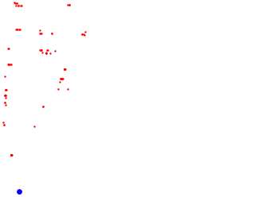

# Stereo Visual Odometry

Visual odometry with bundle adjustment for stereo sequences of the KITTI dataset.

This project implements a stereo visual odometry pipeline that processes stereo image sequences from the KITTI dataset. It computes disparity maps, performs feature matching and triangulation, and refines camera poses using bundle adjustment.

<p align="center">
 
</p>

---

## Table of Contents

- [Overview](#overview)
- [Features](#features)
- [Dependencies](#dependencies)
- [Directory Structure](#directory-structure)
- [Installation](#installation)
- [Usage](#usage)
- [Troubleshooting](#troubleshooting)
- [Contributing](#contributing)
- [License](#license)

---

## Overview

The visual odometry pipeline in this repository processes stereo images by:
- Extracting and matching features between consecutive frames.
- Computing disparity maps from stereo image pairs.
- Triangulating 3D points from matched features.
- Estimating the camera pose using PnP methods.
- Refining camera poses via bundle adjustment.

The pipeline is implemented in C++ and leverages popular libraries such as OpenCV, Ceres Solver, Abseil, and Eigen.

---

## Features

- **Stereo Processing:** Uses left-right image pairs from the KITTI dataset.
- **Feature Matching & Disparity:** Computes feature correspondences and disparity maps for depth estimation.
- **Triangulation:** Converts 2D correspondences to 3D points.
- **Pose Estimation:** Estimates camera motion using methods such as `solvePnP` and `solvePnPRansac`.
- **Bundle Adjustment:** Optimizes camera poses across multiple keyframes.
- **Output Visualization:** Saves intermediate results such as detection images, match images, triangulation visualizations, and numerical outputs.

---

## Dependencies

The project depends on the following libraries:

- **CMake** (version **3.10** or higher)
- **C++ Compiler** with C++17 support
- **OpenCV** (recommended **4.12.0** – used for image processing and visualization)
- **Ceres Solver** (recommended **2.2.0** or later – for bundle adjustment)
- **Abseil** (latest stable version, available via package manager or built from source)

### Installing Dependencies on Ubuntu

```bash
sudo apt-get update
sudo apt-get install -y cmake g++ libopencv-dev libeigen3-dev libceres-dev libgtest-dev
# For Abseil, you may need to install it via your package manager or build from source.
```

For other operating systems, please refer to the corresponding installation guides for each dependency.

---

## Directory Structure

- **`src/`**: Contains the main C++ source code for the visual odometry pipeline.
- **`py_utils/`**: Contains Python utility scripts for visualization.
- **`debug/images/`**: May contain sample or debug images.
- **`outputs/`**: Stores output files such as triangulated points, camera translations, and visualization images (e.g., detections, matches, and triangulation results).
- **`CMakeLists.txt`**: CMake configuration file to build the project.

---

## Installation

1. **Clone the Repository:**

   ```bash
   git clone https://github.com/Dhrumil-Kotadia/Stereo_Visual_Odometry.git
   cd Stereo_Visual_Odometry
   ```

2. **Build the Project:**

   Create a build directory, configure the project with CMake, and compile:

   ```bash
   mkdir build && cd build
   cmake ..
   make
   ```

   This process will generate an executable named `main` in the `build` directory.

---

## Usage

1. **Prepare the KITTI Data:**

   - Download the stereo image sequences from the [KITTI dataset](http://www.cvlibs.net/datasets/kitti/).
   - Place the left and right images in the directories expected by the code. The program uses paths defined in the `create_directories()` function (found in the utility files). You may need to adjust these paths according to your setup.

2. **Run the Executable:**

   From the `build` directory, run:

   ```bash
   ./main
   ```

   The program will:
   - Read stereo images from the specified directories.
   - Compute disparity maps and perform feature matching.
   - Triangulate 3D points from the stereo correspondences.
   - Estimate camera poses using `solvePnP` (and its variants) and refine them with bundle adjustment.
   - Save various output files in the `outputs/` directory:
     - `triangulated_points.txt` – contains 3D point data.
     - `translation.txt` – contains estimated camera translation data.
     - Visualization images (e.g., `detections.png`, `matches.png`, `triangulation_result.png`, etc.).

3. **Review Outputs:**

   Check the `outputs/` folder to analyze the results of the visual odometry process. The saved images can help in verifying feature detections and pose estimation quality.